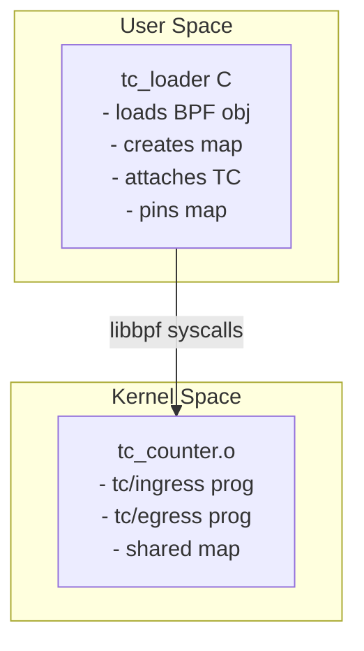

# eBPF TC Plugin (Ingress + Egress) with Shared Map

This repository demonstrates a **minimal, production-correct eBPF Traffic Control (TC) setup** using:

- A **single shared eBPF map**
- **Two TC programs** (ingress + egress)
- A **user-space loader** built with `libbpf`
- A **Linux VM (Lima)** for macOS development
- Deterministic attach/detach and map pinning

The design mirrors how real systems like **Cilium**, **Calico eBPF**, and **modern dataplane agents** manage lifecycle, ownership, and observability.

---

## Architecture Overview



### Key Properties

- **One BPF object load**
- **One map instance**
- **Two programs referencing the same map**
- **Pinned map for observability**
- **Explicit lifecycle control**

---

## Repository Layout

```
.
├── bpf/
│   ├── tc_counter.c    # Kernel eBPF programs (ingress + egress)
│   ├── vmlinux.h       # Kernel BTF-derived types (generated in VM)
│   └── Makefile        # Builds tc_counter.o
│
├── loader/
│   ├── tc_loader.c     # User-space loader (libbpf)
│   └── Makefile        # Builds tc_loader binary
│
├── scripts/
│   ├── 10_lima_create.sh
│   ├── 25_lima_run_bootstrap.sh
│   └── 27_lima_run_bpf_build.sh
│
└── README.md
```

---

## The Kernel Program (`tc_counter.c`)

### What It Contains

- **Two TC programs**
    - `SEC("tc/ingress")`
    - `SEC("tc/egress")`
- **One shared BPF map**
    - `BPF_MAP_TYPE_ARRAY`
    - 2 entries:
        - key `0` → ingress packet count
        - key `1` → egress packet count

### What It Does

```c
SEC("tc/ingress")
int tc_ingress(struct __sk_buff *skb) {
    inc(0);
    return 0;
}

SEC("tc/egress")
int tc_egress(struct __sk_buff *skb) {
    inc(1);
    return 0;
}
```

- Runs on every packet entering or leaving the interface
- Atomically increments counters in the shared map
- Returns `TC_ACT_OK` (allow packet)

### Important Design Choice

The map is defined once in the object, not per program.

This ensures:

- No duplicated state
- Correct aggregation
- Kernel-owned lifetime

---

## The Loader (`tc_loader.c`)

`tc_loader` is a user-space control plane, not a dataplane.

### Responsibilities

- Open and load the BPF object
- Create maps in kernel
- Attach programs to TC ingress + egress
- Pin the shared map
- Hold references to keep programs alive
- Detach cleanly on exit

### Critical Detail: One Load, Two Programs

```c
obj = bpf_object__open_file(obj_path, &open_opts);
bpf_object__load(obj);
```

- Object is loaded **once**
- Both programs (`tc_ingress`, `tc_egress`) come from the same object
- Kernel creates **one instance** of the map
- This is why the counters increment correctly

### Map Pinning

The loader pins the map here:

```
/sys/fs/bpf/ebpf-plugin/counter
```

This allows:

```bash
bpftool map dump pinned /sys/fs/bpf/ebpf-plugin/counter
```

Pinned maps survive:

- Program reloads
- Loader restarts (if not unlinked)

This is exactly how production systems expose dataplane state.

---

## Why Not `tc filter add bpf ...` Directly?

Attaching via `tc` CLI:

- Loads the object **twice**
- Creates **two maps**
- Breaks shared state

This repo intentionally avoids that anti-pattern.

---

## Development Environment (macOS)

Because macOS cannot run eBPF natively, this repo uses Lima.

### One-Command Bring-Up

```bash
./scripts/10_lima_create.sh
./scripts/25_lima_run_bootstrap.sh
./scripts/27_lima_run_bpf_build.sh
```

### What this does:

- Creates a Linux VM
- Installs kernel headers, `bpftool`, `libbpf`
- Builds eBPF + loader
- Attaches ingress + egress
- Pins the shared map
- Generates traffic
- Shows counters incrementing

### Example Output

```json
[map] pinned counter map (after traffic):
[
  { "key": 0, "value": 40 },
  { "key": 1, "value": 40 }
]
```

Ingress and egress counters increase independently — from the same map.

---

## How This Maps to Real Systems

| Concept here | Production equivalent |
|--------------|----------------------|
| `tc_counter.c` | Cilium / Calico dataplane |
| `tc_loader.c` | Agent / Daemon |
| pinned map | Metrics / policy state |
| TC hook | L2/L3 enforcement |
| shared map | Connection / packet state |

---

## When to Use This Pattern

Use this design when you need:

- Shared state across multiple hooks
- Deterministic attach/detach
- Observability without rebuilding
- Clean ownership semantics
- Compatibility with systemd / Kubernetes agents

---

## Next Steps

Possible extensions:

- Per-CPU maps
- Hash maps keyed by tuple
- XDP + TC hybrid
- Go loader (`libbpfgo`)
- Netlink-driven interface discovery
- Prometheus exporter reading pinned maps

---

## License

GPL (kernel requirement)

---

## Author

**Michael Williams**  
Platform Engineering · Kubernetes · eBPF · Systems Architecture
